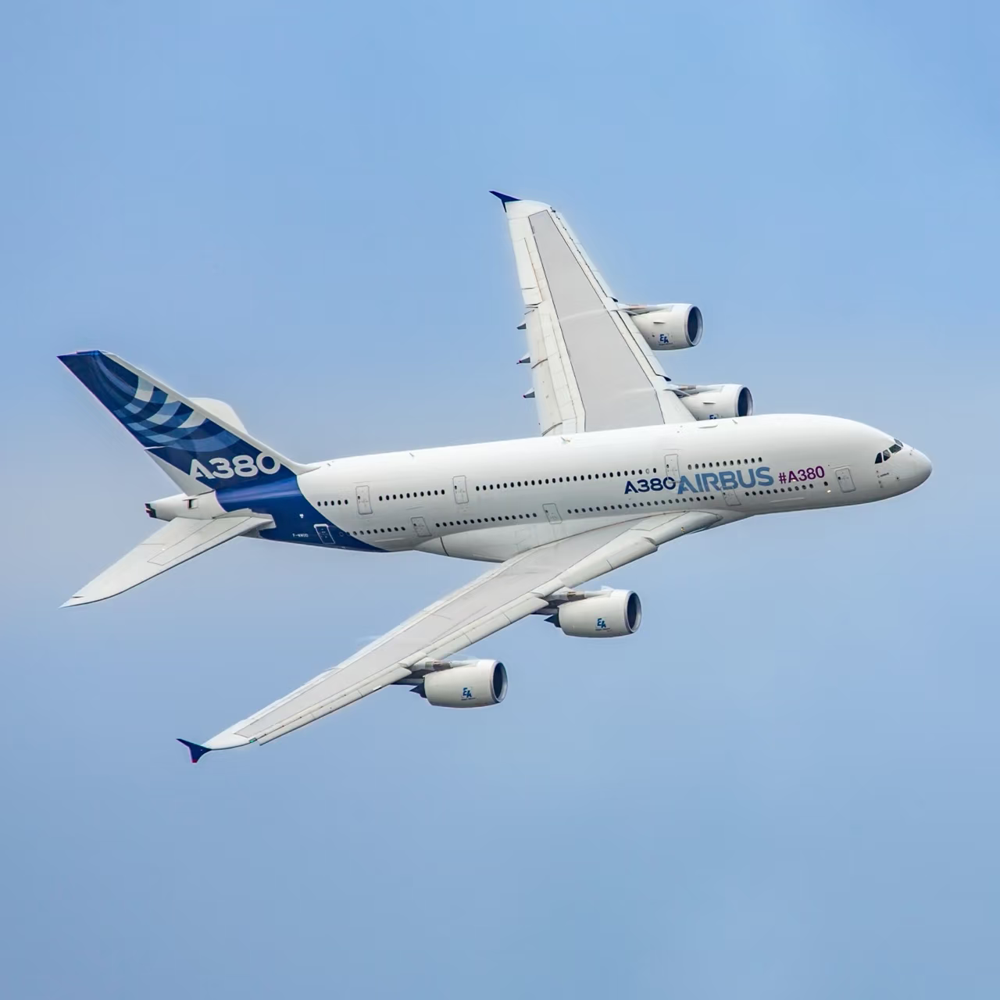

# STQD6324-Assignment-2

# Airline On-Time Performance Analysis (2005)

## Overview

This project analyzes U.S. domestic flight operations in the year 2005, focusing on **flight delays, cancellations, and route reliability**. Using Hive and Jupyter Notebook, the analysis extracts, cleans, and visualizes large-scale airline data to uncover operational inefficiencies and support decision-making for both airlines and passengers.

---

## Tools and Technologies

- **Hive SQL** – for scalable querying of large datasets
- **Jupyter Notebook** – for interactive analysis and visualization
- **Python libraries**:
  - `pandas` – data manipulation
  - `matplotlib` & `seaborn` – plotting and charts
  - `pyhive` – database connection to Hive

---

## Key Analytical Sections

### 1. Delay Pattern Analysis
- Explored average arrival delays by time of day, weekday, month, and season.
- Found that **midnight and summer flights have the highest average delays**, while **morning and spring flights are more punctual**.

### 2. Delay Factor Analysis
- Analyzed major causes of delays: carrier-related, NAS (air traffic), late aircraft, weather, and security.
- **Carrier delay and NAS delay** emerged as dominant contributors.

### 3. Cancellation Analysis
- Investigated monthly and seasonal cancellation trends.
- **Winter and Q1** showed the **highest cancellation rates**, likely due to weather disruptions.

### 4. Problematic Route Analysis
- Identified routes with more than 50 flights and the highest average arrival delays.
- Many problematic routes were connected to **EWR**, indicating operational or congestion issues.

---

## Conclusion

This time, the reasons for flight delays were systematically analyzed based on U.S. domestic flight operation data from 2005, covering the dimensions of **delay patterns, delay causes, cancellation behaviors, and identification of problematic routes and airlines**. The project utilized **Hive** for large-scale SQL queries, in combination with **Jupyter Notebook**, **Pandas**, and visualization tools to complete data cleaning, transformation, and chart generation, forming a complete data analysis pipeline.

The analysis revealed that **flight delays exhibit clear temporal patterns**: early morning departures, summer months, and Thursdays show relatively higher average delays, while flights in the **morning, spring/fall seasons, and Saturdays** are generally more punctual. **Cancellations are most frequent in winter and the first quarter**, indicating strong seasonal effects. Route analysis identified several **problematic routes** with average delays exceeding 30 minutes — particularly those connected to **EWR** — suggesting congestion or operational bottlenecks at that location.

Additionally, the comparative analysis of airlines showed that **FL** and **AS** have significantly higher average delays, while ** HA** demonstrated outstanding punctuality. Overall, **flight delays and cancellations display structural differences across time, route, carrier, and airport dimensions**. This project not only deepened the understanding of operational complexity in the aviation industry, but also validated the practical value of **data analytics tools in air transport management and decision-making**.

---

## Recommendations

### For Airlines:
- Optimize schedules for **early morning and winter flights**
- Monitor **high-delay airports and routes**, especially EWR-related connections
- Create a **flight risk scoring system** to guide resource allocation

### For Passengers:
- Prefer **morning flights** and **spring/fall travel**
- Avoid risky flight numbers and **midnight departures**
- Consider airline punctuality performance when booking (e.g., avoid FL/AS, favor HA/WN)

---

## 📁 File Structure
├── Assignment2_P146399.ipynb # Main Jupyter Notebook for the entire analysis
├── README.md # Project documentation 
└── images/
    └── airplane.png

---

## Author Info

- **Name:** MAO JINLIN
- **Course:** STQD6324 Data Management
- **Year:** 2025
- **Institution:** Univerdity Kebangsaan Malaysia
